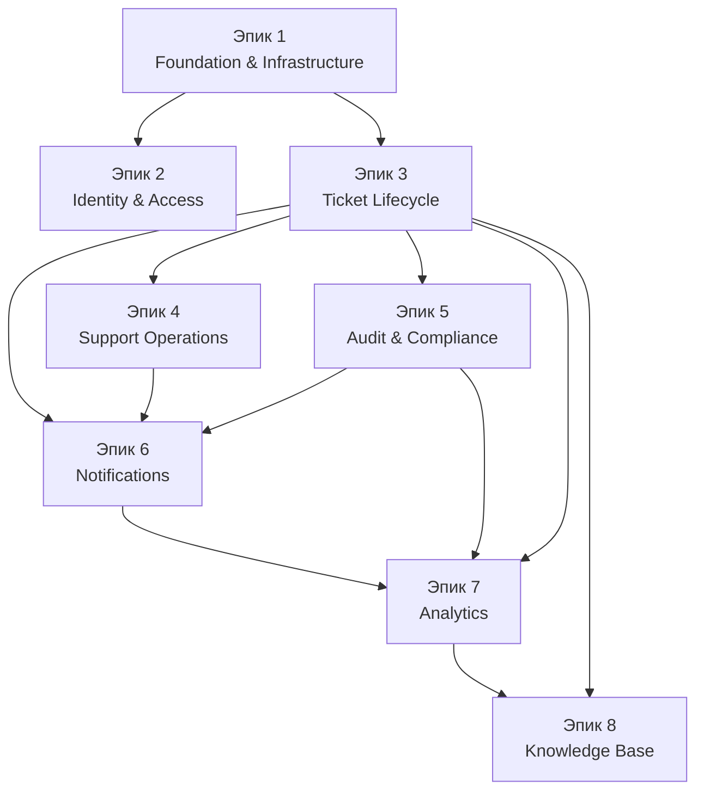

# Tech-Support — Epic Breakdown

## Контекст и допущения

- Документ основан на требованиях [PRD](./PRD.md), архитектурных решениях в [architecture-2025-11-06.md](./architecture-2025-11-06.md) и стратегии DevOps из [devops-strategy-2025-11-06.md](./devops-strategy-2025-11-06.md).
- MVP охватывает эпики 1-6. Эпики 7-8 подготавливают аналитическую и knowledge base инфраструктуру.
- Все эпики разрабатываются в модульном монолите на Spring Modulith с управлением конфигурациями через GitOps.
- Нефункциональные требования собраны в разделе эпиков и согласованы с командами SRE и Security.

## Обзор

Документ описывает эпики проекта Tech-Support и декомпозицию на пользовательские истории, готовые к автономной разработке. Содержит контекст, зависимости, нефункциональные ожидания и артефакты, обеспечивающие трассируемость.

## Сводка эпиков

1. **Эпик 1: Foundation & Infrastructure Enablement** — базовая инфраструктура, CI/CD, контейнеризация и безопасность.
2. **Эпик 2: Identity & Access Control** — регистрация, верификация, RBAC/ABAC и самообслуживание.
3. **Эпик 3: Ticket Lifecycle Management** — управление тикетами от создания до автозакрытия.
4. **Эпик 4: Support Operations Optimization** — очереди, само-назначение, SLA-правила и дашборды.
5. **Эпик 5: Audit & Compliance Guardrails** — WORM-аудит, retention, legal hold и средства проверки.
6. **Эпик 6: Omni-Channel Notifications** — Telegram, email, предпочтения, очередь и мониторинг.
7. **Эпик 7: Analytics & Insights** — аналитическое хранилище, дашборды, прогнозирование SLA.
8. **Эпик 8: Knowledge Base Launchpad** — подготовка к базе знаний, телеметрия и обратная связь.

## Диаграмма зависимостей эпиков

### Рекомендуемая последовательность

- 1 → 2 → 3 → (4 ∥ 5) → 6 → 7 → 8
- Эпики 1-6 закрываются до запуска MVP.

## Трассируемость эпиков и артефактов

| Эпик | Основные истории | Связанные артефакты |
| ---- | ---------------- | ------------------- |
| 1 | 1.1–1.5 | PRD, architecture-2025-11-06.md, devops-strategy-2025-11-06.md |
| 2 | 2.1–2.6 | PRD, security guidelines, docs/faq.md |
| 3 | 3.1–3.6 | PRD, docs/quick-start.md, docs/glossary.md |
| 4 | 4.1–4.5 | PRD, devops-strategy-2025-11-06.md, docs/analytics.md (в разработке) |
| 5 | 5.1–5.5 | docs/validation-report-2025-11-05.md, docs/bmm-research-technical-2025-11-05.md |
| 6 | 6.1–6.5 | PRD, docs/architecture-2025-11-06.md (notification section) |
| 7 | 7.1–7.5 | docs/epics-analytics.md (черновик), architecture-2025-11-06.md |
| 8 | 8.1–8.3 | docs/bmm-research-technical-2025-11-05.md, docs/faq.md |

---

## Эпик 2: Identity & Access Control

**Цель:** Обеспечить безопасную регистрацию, подтверждение личности, управление ролями и самообслуживание аккаунта в соответствии с GDPR.  
**Ценность:** Гарантирует безопасный доступ к системе и выполнение регуляторных требований.  
**Нефункциональные ожидания:**

- Регистрация и верификация работают при пиковой нагрузке до 50 одновременных регистраций.
- Все операции аутентификации и управления учетными данными фиксируются в audit trail.
- Хранение паролей и токенов производится с использованием современных криптографических практик, данные в пути зашифрованы.

**Связанные артефакты:** [PRD](./PRD.md#identity), [security baseline](./validation-report-2025-11-05.md), [faq.md](./faq.md#identity).

### История 2.1: Self-registration с политикой паролей

**Пользовательская история:** Как новый сотрудник, я хочу зарегистрироваться самостоятельно, чтобы создавать тикеты без помощи администратора.

**Acceptance Criteria:**

1. Эндпоинт `POST /api/v1/auth/register` принимает email, пароль и профильные данные, проверяет уникальность email.
2. Пароль соответствует политике (≥12 символов, верхний/нижний регистр, цифра, спецсимвол), ошибки возвращаются в унифицированном формате.
3. Учётная запись создаётся в статусе `pending_verification`, пароль хэшируется BCrypt с cost ≥12.
4. Генерируется событие аудита `USER_REGISTERED` с маскировкой PII.

**Prerequisites:** Эпик 1 (истории 1.1–1.3).

**Технические заметки:**

- Реализовать bean validation и локализацию ошибок.
- Покрыть юнит-тестами политику паролей и обработку дубликатов.

### История 2.2: Email verification сервис

**Пользовательская история:** Как система, я хочу подтверждать email одноразовым токеном, чтобы гарантировать владение адресом.

**Acceptance Criteria:**

1. Таблица `verification_tokens` хранит одноразовые токены с TTL 24 часа.
2. Эндпоинт `/api/v1/auth/verify?token=...` переводит статус пользователя в `pending_approval` при валидном токене.
3. Истёкшие и повторно использованные токены отклоняются, событие фиксируется как `EMAIL_VERIFICATION_FAILED`.
4. Отправка письма происходит через SMTP/SendGrid (mock в dev), логируется результат.

**Prerequisites:** История 2.1.

**Технические заметки:**

- Добавить интеграционные тесты на happy path и просроченные токены.
- Секреты SMTP хранить в Vault/Secrets Manager.

### История 2.3: Approve/Reject заявок администратором

**Пользовательская история:** Как администратор, я хочу утверждать или отклонять новые аккаунты, чтобы контроль доступа оставался безопасным.

**Acceptance Criteria:**

1. Эндпоинт `GET /api/v1/admin/registrations` возвращает заявки в статусе `pending_approval`.
2. Эндпоинты approve/reject переводят учётные записи в `active` с ролью `ROLE_EMPLOYEE` или `rejected` с retention 90 дней.
3. Audit фиксирует действия с деталями администратора, инициатор получает уведомление (email/Telegram).
4. UI-стаб или API-спецификация подготовлены для фронтенд-команды.

**Prerequisites:** Истории 2.1–2.2.

**Технические заметки:**

- Защитить эндпоинты ролями `ROLE_ADMIN` и добавить интеграционные тесты.
- Добавить фильтры и пагинацию для списка заявок.

### История 2.4: RBAC/ABAC и управление ролями

**Пользовательская история:** Как администратор, я хочу управлять ролями пользователей, чтобы безопасно назначать права.

**Acceptance Criteria:**

1. Эндпоинт управления ролями доступен только `ROLE_ADMIN`, проверяет наличие хотя бы одного активного администратора.
2. Доступны роли `ROLE_EMPLOYEE`, `ROLE_SUPPORT`, `ROLE_SUPPORT_LEAD`, `ROLE_ADMIN`, `ROLE_AUDITOR`.
3. Изменения ролей фиксируются в аудите `ROLE_CHANGED`, включают старую и новую роль.
4. ABAC-правила обеспечивают доступ к тикетам только владельцам/назначенным и администраторам через `@PreAuthorize` и фильтры запросов.

**Prerequisites:** История 2.3.

**Технические заметки:**

- Настроить таблицы `users`, `user_roles` и пересмотр прав.
- Включить integration tests для матрицы доступа.

### История 2.5: Обновление профиля пользователя

**Пользовательская история:** Как пользователь, я хочу редактировать профиль, чтобы поддерживать актуальные данные.

**Acceptance Criteria:**

1. Эндпоинт `PUT /api/v1/users/me` принимает изменения профиля и требует подтверждения текущим паролем.
2. Обновляются поля `full_name`, `department`, `location`, `phone`; изменения валидируются и нормализуются.
3. Audit `PROFILE_UPDATED` фиксирует список полей без раскрытия PII.
4. Логи очищают входные данные от потенциальных XSS.

**Prerequisites:** История 2.4.

**Технические заметки:**

- DTO должен вычислять diff и маскировать телефон.
- Добавить юнит-тесты на sanitization и проверку пароля.

### История 2.6: Смена пароля с историей и блокировкой

**Пользовательская история:** Как пользователь, я хочу безопасно менять пароль, чтобы защищать учётную запись.

**Acceptance Criteria:**

1. Эндпоинт `POST /api/v1/auth/change-password` проверяет текущий пароль и историю последних пяти паролей.
2. Новый пароль сохраняется с BCrypt и фиксируется timestamp смены, активные сессии сбрасываются.
3. После смены отправляется email-уведомление, аудиторская запись `PASSWORD_CHANGED` создаётся.
4. Пять неудачных попыток входа подряд приводят к 15-минутной блокировке и событию `LOGIN_FAILED`.

**Prerequisites:** Истории 2.1–2.5.

**Технические заметки:**

- Реализовать фильтр подсчёта неудачных логинов.
- Документировать cron-уведомление о скорой экспирации пароля (80-й день).

---

## Эпик 3: Ticket Lifecycle Management

**Цель:** Обеспечить полный жизненный цикл тикета от создания до автоматического закрытия с прозрачной историей.  
**Ценность:** Даёт основную бизнес-функцию и обеспечивает контроль SLA.  
**Нефункциональные ожидания:**

- Среднее время ответа API ≤300 мс, p95 ≤500 мс при нагрузке в 50k тикетов.
- Все события тикетов фиксируются в audit trail с неизменяемой историей.
- Отсутствуют N+1 запросы, выборки оптимизированы индексами и проекциями.
**Связанные артефакты:** [PRD](./PRD.md#ticketing), [quick-start.md](./quick-start.md#ticket), [glossary.md](./glossary.md#ticket).

### История 3.1: Создание тикета с валидацией и автоприсвоением

**Пользовательская история:** Как сотрудник, я хочу создавать тикеты с описанием проблемы, чтобы инициировать поддержку.

**Acceptance Criteria:**
1. Эндпоинт `POST /api/v1/tickets` принимает валидные данные, создаёт UUID, автора, статус `OPEN`, `created_at`.
2. Поле `category` обязательное, приоритет по умолчанию `P3`, возможна передача `P1–P5`.
3. Создаётся событие аудита `TICKET_CREATED` и бизнес-событие для очередей уведомлений.
4. Возвращается DTO без чувствительных данных, логи маскируют PII.

**Prerequisites:** Эпики 1–2.

**Технические заметки:**
- Использовать Spring Data и проверки ABAC на уровне репозитория.
- Покрыть сценарии валидации юнит и интеграционными тестами.

### История 3.2: Просмотр списка тикетов с фильтрами и поиском

**Пользовательская история:** Как пользователь, я хочу видеть релевантные тикеты с фильтрами, чтобы быстро находить обращения.

**Acceptance Criteria:**
1. Эндпоинт `GET /api/v1/tickets` возвращает страницы по 20 записей (максимум 100) с учётом ролей (`ROLE_EMPLOYEE` — свои, `ROLE_SUPPORT` — назначенные и открытые, `ROLE_ADMIN` — все).
2. Доступны фильтры по статусу, приоритету, категории, тегам и полнотекстовый поиск (GIN индекс).
3. Ответ содержит поля SLA (дедлайн, оставшееся время), сортировки работают по created_at, priority, SLA.
4. p95 времени ответа ≤500 мс при 50k тикетах, результаты кешируются 30 секунд для повторных запросов.

**Prerequisites:** История 3.1.

**Технические заметки:**
- Настроить Spring Data Pageable и прогоны перф-тестов.
- Реализовать ABAC фильтры для доступности данных.

### История 3.3: Просмотр деталей тикета и истории

**Пользовательская история:** Как пользователь, я хочу видеть карточку тикета и историю, чтобы понимать контекст и прогресс.

**Acceptance Criteria:**
1. Эндпоинт `GET /api/v1/tickets/{id}` возвращает детали, комментарии, назначение, историю статусов.
2. Эндпоинт `GET /api/v1/tickets/{id}/history` возвращает audit-события с сортировкой по времени.
3. Добавлены ETag/If-None-Match для кеширования ответов.
4. Запросы оптимизированы: нет N+1, используются fetch join или проекции.

**Prerequisites:** Истории 3.1–3.2, Эпик 5 (аудит) в разработке.

**Технические заметки:**
- Реализовать DTO-мэппинг и фильтрацию полей по ролям.
- Провести интеграционные тесты на доступ и кеширование.

### История 3.4: Добавление комментариев к тикету

**Пользовательская история:** Как агент поддержки, я хочу оставлять комментарии, чтобы фиксировать прогресс и взаимодействие.

**Acceptance Criteria:**
1. Эндпоинт `POST /api/v1/tickets/{id}/comments` доступен ролям `ROLE_SUPPORT` и `ROLE_ADMIN`.
2. Комментарии неизменяемы (5–2000 символов), сохраняют автора и timestamp, создаётся `COMMENT_ADDED`.
3. Владелец тикета получает уведомление, комментарии отображаются в хронологическом порядке.
4. Редактирование и удаление комментариев запрещены, попытки фиксируются.

**Prerequisites:** Истории 3.1–3.3, интеграция с эпиком 6 может использовать mock.

**Технические заметки:**
- Таблица `ticket_comments` с optimistic locking.
- Интеграционные тесты с mock notification service.

### История 3.5: Назначение тикета и управление статусами

**Пользовательская история:** Как агент поддержки, я хочу назначать тикеты и менять статусы, чтобы контролировать прогресс.

**Acceptance Criteria:**
1. Эндпоинты `PUT /api/v1/tickets/{id}/assign` и `/status` соблюдают RBAC/ABAC, поддерживают self-assign.
2. Матрица переходов: `OPEN → IN_PROGRESS → RESOLVED → CLOSED`, `RESOLVED → IN_PROGRESS` при переоткрытии.
3. Для `RESOLVED` и `CLOSED` обязательны `resolution_notes`, события `TICKET_ASSIGNED` и `STATUS_CHANGED` логируются.
4. Уведомления инициатору отправляются через сервис уведомлений.

**Prerequisites:** Истории 3.1–3.4, Эпики 2 и 6.

**Технические заметки:**
- Использовать state-machine или ручную проверку переходов с unit-тестами.
- Транзакционные события должны публиковать бизнес-ивенты для уведомлений.

### История 3.6: Автоматическое закрытие и переоткрытие тикетов

**Пользовательская история:** Как системный планировщик, я хочу автоматизировать закрытие и переоткрытие тикетов, чтобы поддерживать SLA и ясность статусов.

**Acceptance Criteria:**
1. Планировщик проверяет тикеты `RESOLVED`; при отсутствии активности 7 дней переводит в `CLOSED`, фиксируя `closed_at` и `closed_by` = `system`.
2. При активности в течение 7 дней тикет возвращается в `IN_PROGRESS` с событием `TICKET_REOPENED`.
3. Audit фиксирует каждое автоматическое изменение статуса.
4. Документация содержит cron-правила и обработку часовых поясов/праздников.

**Prerequisites:** Истории 3.1–3.5, планировщик из эпика 1.

**Технические заметки:**
- Использовать Spring Scheduling или Quartz, сценарии edge cases покрыть тестами.
- Включить конфигурацию для настройки периода ожидания.

---

## Эпик 4: Support Operations Optimization

**Цель:** Повысить эффективность саппорт-операций за счёт умных очередей, само-назначения, SLA-правил и мониторинга нагрузки.  
**Ценность:** Сокращает время реакции, балансирует загрузку, обеспечивает прозрачность SLA.  
**Нефункциональные ожидания:**
- Очередь операций обновляется в реальном времени с задержкой ≤2 секунд.
- Правила SLA управляются без деплоя и версионируются в базе.
- Дашборды предоставляют данные с точностью до минуты, экспортируются в CSV и Prometheus.
**Связанные артефакты:** [PRD](./PRD.md#operations), [devops-strategy-2025-11-06.md](./devops-strategy-2025-11-06.md#operations), [architecture-2025-11-06.md](./architecture-2025-11-06.md#operations).

### История 4.1: Управление очередью тикетов и приоритезация

**Пользовательская история:** Как руководитель поддержки, я хочу видеть очередь тикетов с приоритетами, чтобы перераспределять работу и соблюдать SLA.

**Acceptance Criteria:**
1. Эндпоинт `GET /api/v1/operations/queue` возвращает активные тикеты (`OPEN`, `IN_PROGRESS`), отсортированные по SLA-дедлайну, приоритету и времени создания.
2. Фильтры по категории, агенту, статусу доступны, результаты видимы ролям `ROLE_SUPPORT_LEAD` и `ROLE_ADMIN`.
3. SLA-нарушения помечаются флагом/цветом и доступны через API для UI.
4. Очередь обновляется через SSE или WebSocket без перезагрузки страницы.

**Prerequisites:** Истории 3.1–3.5, RBAC из эпика 2.

**Технические заметки:**
- Использовать материализованное представление или оптимизированный запрос с расчётом SLA-дедлайна.
- Настроить кэширование для повторных запросов и invalidate при изменениях статусов.

### История 4.2: Само-назначение тикета агентом

**Пользовательская история:** Как агент поддержки, я хочу брать тикет из очереди, чтобы быстро реагировать без ручного распределения.

**Acceptance Criteria:**
1. Эндпоинт `POST /api/v1/operations/queue/{ticketId}/self-assign` доступен ролям `ROLE_SUPPORT`.
2. Система проверяет, что у агента ≤5 активных тикетов; при превышении возвращает контролируемую ошибку.
3. Тикет переводится в `IN_PROGRESS`, создаётся событие `TICKET_SELF_ASSIGNED` и уведомление инициатору.
4. Операция защищена от гонок через оптимистическую блокировку.

**Prerequisites:** Истории 3.5, 4.1.

**Технические заметки:**
- Добавить rate limit на повторные попытки одного агента.
- Логи фиксируют бизнес-решение (кто взял тикет, с какой очереди).

### История 4.3: Rule engine для SLA и автоматических эскалаций

**Пользовательская история:** Как менеджер по операциям, я хочу автоматически эскалировать тикеты при риске нарушения SLA, чтобы минимизировать просрочки.

**Acceptance Criteria:**
1. Правила SLA управляются конфигурацией (YAML/БД) с версиями, правки фиксируются в аудите.
2. Планировщик оценивает тикеты каждые X минут и переводит их в `ESCALATED` при достижении порогов (например, 80% времени).
3. Назначается ответственный руководитель, инициатор и текущий агент получают уведомления, создаётся `SLA_ESCALATED`.
4. Просмотр истории правил доступен через API для админов.

**Prerequisites:** Истории 4.1–4.2, интеграция с эпиком 6 (уведомления, возможно mock).

**Технические заметки:**
- Рассмотреть Drools/легковесный движок правил на Spring StateMachine.
- Добавить юнит-тесты для правил и конфигурации.

### История 4.4: Дашборд SLA breach и workload insights

**Пользовательская история:** Как руководитель поддержки, я хочу видеть показатели по нагрузке и SLA-нарушениям, чтобы планировать ресурсы.

**Acceptance Criteria:**
1. Интерфейс `/ui/operations/workload` показывает активные тикеты на агента, % просрочек, среднее время до первого ответа.
2. Данные обновляются в реальном времени без перезагрузки страницы, доступны экспорт в CSV и Prometheus-метрики.
3. Доступ ограничен ролями `ROLE_SUPPORT_LEAD`, `ROLE_OPERATIONS_MANAGER`, `ROLE_ADMIN`.
4. Документация содержит структуру дашборда и показатели.

**Prerequisites:** Истории 4.1–4.3, интеграция с эпиком 7 (аналитика) может использовать заглушки.

**Технические заметки:**
- Использовать SSE/WebSocket и Prometheus-коннектор.
- Реализовать единый источник данных (view или OLAP-запрос).

### История 4.5: Интеграция расписания смен и календаря отпусков

**Пользовательская история:** Как руководитель поддержки, я хочу учитывать расписание смен и отпусков, чтобы избегать назначения тикетов недоступным агентам.

**Acceptance Criteria:**
1. Импорт файлов ICS/CSV сохраняет данные в `agent_availability`, nightly job обновляет расписание.
2. При само-назначении или назначении система проверяет активную смену/доступность.
3. При отсутствии доступности предлагается альтернативный агент или тикет ставится в очередь сменщика, создаётся `SHIFT_OVERRIDE`.
4. Все изменения логируются и доступны для аудита.

**Prerequisites:** Истории 4.1–4.3, интеграция с HR-календарём (mock).

**Технические заметки:**
- Реализовать обработку пересечений смен и отпусков.
- Добавить unit-тесты на крайние случаи.

---

## Эпик 5: Audit & Compliance Guardrails

**Цель:** Обеспечить неизменяемый аудит, инструменты ретенции и поддержку compliance-аудитов.  
**Ценность:** Закрывает регуляторные требования, повышает доверие пользователей.
**Нефункциональные ожидания:**
- Audit pipeline выдерживает ≥500 событий в минуту без потери данных.
- Все операции аудита защищены от модификации (WORM) и проверяются регулярными integrity-check.
- Retention-политики документированы и выполняются автоматически.
**Связанные артефакты:** [validation-report-2025-11-05.md](./validation-report-2025-11-05.md#audit), [bmm-research-technical-2025-11-05.md](./bmm-research-technical-2025-11-05.md#audit).

### История 5.1: Построить WORM audit pipeline

**Пользовательская история:** Как специалист по комплаенсу, я хочу иметь неизменяемый журнал действий, чтобы подтверждать соответствие политике безопасности.

**Acceptance Criteria:**
1. Audit сервис записывает события в таблицу `audit_log` (JSONB) с append-only политикой.
2. PostgreSQL триггеры предотвращают `UPDATE/DELETE`, попытки фиксируются.
3. Данные хэшируются цепочкой SHA-256 для проверки целостности.
4. Документация описывает retention и политики доступа.

**Prerequisites:** Эпики 1–3, 4 (источники событий).

**Технические заметки:**
- Настроить RLS и роли для чтения.
- Добавить unit-тесты триггеров и целостности.

### История 5.2: Retention и legal hold политики

**Пользовательская история:** Как DPO, я хочу управлять периодом хранения и legal hold, чтобы соответствовать регуляторным требованиям.

**Acceptance Criteria:**
1. Конфигурация retention хранит сроки хранения (например, 7 лет), nightly job удаляет данные по истечении срока.
2. Legal hold блокирует удаление записей, пока не завершён процесс.
3. Audit фиксирует события `RETENTION_PURGE` с деталями объёма и диапазона.
4. Ежедневный отчёт отправляется в compliance-почту.

**Prerequisites:** История 5.1.

**Технические заметки:**
- Использовать stored procedure с soft-delete флагом.
- Покрыть unit-тестами расписание и edge cases.

### История 5.3: Audit viewer API и RBAC фильтрация

**Пользовательская история:** Как аудитор, я хочу просматривать историю действий, чтобы проводить расследования.

**Acceptance Criteria:**
1. Эндпоинт `GET /api/v1/audit` поддерживает фильтры по `ticketId`, `userId`, типу, диапазону дат.
2. Результаты доступны ролям `ROLE_AUDITOR` и `ROLE_ADMIN`, PII маскируется для ролей без разрешения.
3. Предусмотрен экспорт в CSV.
4. Запросы оптимизированы (view/индексы), логируются.

**Prerequisites:** История 5.1, RBAC из эпика 2.

**Технические заметки:**
- Внедрить column masking и view для агрегирования.
- Добавить интеграционные тесты доступа.

### История 5.4: Мониторинг целостности аудита

**Пользовательская история:** Как специалист по комплаенсу, я хочу получать алерты при подозрительных изменениях аудита, чтобы быстро реагировать.

**Acceptance Criteria:**
1. Плановый job проверяет цепочку хэшей аудита и публикует метрику `audit_chain_ok`.
2. При расхождении создаётся событие `AUDIT_CHAIN_BROKEN` и уведомление в security-канал.
3. UI `/ui/compliance/health` отображает статус целостности.
4. Документация описывает runbook для реакции.

**Prerequisites:** Истории 5.1–5.3, Эпик 6 (уведомления).

**Технические заметки:**
- Настроить Prometheus alert и интеграцию с уведомлениями.
- Добавить unit-тесты на проверку целостности.

### История 5.5: GDPR subject access и erasure tooling

**Пользовательская история:** Как DPO, я хочу обрабатывать запросы на доступ и удаление данных, чтобы соблюдать SLA GDPR.

**Acceptance Criteria:**
1. Workflow DSAR собирает данные пользователя (аудит, тикеты), генерирует отчёт.
2. Удаление запускается после ручного подтверждения, создаётся `DSAR_COMPLETED`.
3. SLA отслеживается, статус доступен через UI/API.
4. Логируются все действия, предусмотрен manual override.

**Prerequisites:** Истории 2.5, 5.1–5.3.

**Технические заметки:**
- Использовать Spring Batch или аналогичный оркестратор.
- Добавить интеграционные тесты на redaction/retain сценарии.

---

## Эпик 6: Omni-Channel Notifications

**Цель:** Доставлять своевременные уведомления через Telegram и email, учитывать предпочтения и надёжность доставки.  
**Ценность:** Обеспечивает SLA <4 часов за счёт мгновенных алертов и надёжных fallback-каналов.  
**Нефункциональные ожидания:**
- Уведомления доставляются за ≤1 минуту в 95% случаев.
- Retry-механизмы обеспечивают ≥99% доставку при временных сбоях.
- Состояние каналов мониторится через health-check и алертинг.
**Связанные артефакты:** [PRD](./PRD.md#notifications), [architecture-2025-11-06.md](./architecture-2025-11-06.md#notifications).

### История 6.1: Telegram Bot интеграция для критичных уведомлений

**Пользовательская история:** Как агент поддержки, я хочу получать алерты в Telegram, чтобы оперативно реагировать на новые или эскалированные тикеты.

**Acceptance Criteria:**
1. Пользователь привязывает Telegram через `POST /api/v1/notifications/telegram/link`, токен подтверждает идентичность.
2. При назначении или эскалации тикета бот отправляет сообщение с деталями и deep-link.
3. Доставка фиксируется как `NOTIFICATION_SENT`, ошибки логируются и направляются в retry.
4. API учитывает пользовательские предпочтения.

**Prerequisites:** Эпики 2–5, event bus из эпика 3.

**Технические заметки:**
- Использовать Telegram Bot API с webhook endpoint.
- Добавить unit-тесты и mock Telegram в интеграционных тестах.

### История 6.2: Email fallback и шаблоны уведомлений

**Пользовательская история:** Как сотрудник, я хочу получать уведомления по email, чтобы не пропускать обновления при отсутствии Telegram.

**Acceptance Criteria:**
1. При отсутствии Telegram или провале доставки используется email через SMTP/SendGrid.
2. Шаблоны уведомлений параметризованы, отправка логируется.
3. Настроен retry с экспоненциальной задержкой, статус сохраняется.
4. Ошибки выводятся в Prometheus и audit.

**Prerequisites:** История 6.1, SMTP из истории 2.2.

**Технические заметки:**
- Применить Spring Mail или SendGrid SDK.
- Подготовить preview шаблонов в `docs/notifications`.

### История 6.3: Управление предпочтениями и мьютинг каналов

**Пользовательская история:** Как пользователь, я хочу настраивать каналы и типы уведомлений, чтобы получать релевантные сигналы.

**Acceptance Criteria:**
1. Эндпоинт `PUT /api/v1/notifications/preferences` сохраняет выбор каналов и типов событий.
2. Изменения применяются мгновенно, учитываются в отправке Telegram/email.
3. Audit `PREFERENCE_UPDATED` фиксирует изменение без раскрытия PII.
4. Предусмотрены настройки mute/quiet hours.

**Prerequisites:** Истории 2.5, 6.1–6.2.

**Технические заметки:**
- Таблица `notification_preferences` с кешированием (Redis).
- Добавить юнит-тесты на валидацию и применение.

### История 6.4: Очередь доставки и retry механизм

**Пользовательская история:** Как система, я хочу гарантировать доставку сообщений, чтобы уведомления не терялись при сбоях.

**Acceptance Criteria:**
1. Уведомления попадают в очередь (PostgreSQL/Redis) и обрабатываются worker-ом.
2. При недоступности канала выполняется до пяти повторных попыток с backoff.
3. После исчерпания попыток создаётся alert в операционный канал, записывается `NOTIFICATION_FAILED`.
4. Prometheus метрика `notification_failures_total` отслеживает состояние.

**Prerequisites:** Истории 6.1–6.3.

**Технические заметки:**
- Использовать Spring Integration/Resilience4j или аналог.
- Реализовать dead-letter очередь.

### История 6.5: Health monitoring и alerting

**Пользовательская история:** Как SRE, я хочу отслеживать состояние каналов уведомлений, чтобы быстро реагировать на инциденты.

**Acceptance Criteria:**
1. Health endpoint `/actuator/health/notifications` отражает статус каналов, падает при ≥3 сбоях подряд.
2. Grafana генерирует alert, событие `NOTIFICATION_CHANNEL_DOWN` логируется.
3. Документация содержит runbook по восстановлению.
4. Метрики доступны в Prometheus, покрывают latency и errors.

**Prerequisites:** Истории 6.1–6.4, наблюдаемость из эпика 1.

**Технические заметки:**
- Реализовать кастомный `HealthIndicator` и alerting-правила.
- Добавить проверку зависимости от внешних сервисов.

---

## Эпик 7: Analytics & Insights

**Цель:** Предоставить метрики по объёму тикетов, SLA и загрузке для управленческих решений.  
**Ценность:** Помогает планировать ресурсы, выявлять узкие места и прогнозировать SLA.  
**Нефункциональные ожидания:**
- ETL выполняется nightly без влияния на OLTP, данные доступны к 06:00 локального времени.
- Дашборды обновляются ежедневно или по запросу, отображают тренды за 7/30/90 дней.
- API для аналитики выдерживает ≥30 запросов/сек без деградации.
**Связанные артефакты:** [architecture-2025-11-06.md](./architecture-2025-11-06.md#analytics), черновик `docs/epics-analytics.md`.

### История 7.1: Аналитический слой и ETL

**Пользовательская история:** Как аналитик, я хочу структурированное хранилище метрик, чтобы строить отчёты без нагрузки на OLTP.

**Acceptance Criteria:**
1. Nightly job выполняет ETL, агрегируя данные в `fact_ticket`, `dim_user`, `dim_time`.
2. Процесс логирует успехи/ошибки, отправляет уведомления при сбоях.
3. Доступны materialized views для быстрых запросов, обновляются после ETL.
4. Документация описывает схемы и зависимости.

**Prerequisites:** Эпики 3–6.

**Технические заметки:**
- Рассмотреть Spring Batch или DBT.
- Добавить тесты ETL на корректность агрегатов.

### История 7.2: Dashboard ticket volume και SLA performance

**Пользовательская история:** Как менеджер поддержки, я хочу видеть тренды тикетов и SLA, чтобы управлять ресурсами.

**Acceptance Criteria:**
1. `/ui/analytics/overview` отображает графики по категориям, SLA compliance, среднему времени ответа.
2. Данные обновляются ежедневно, доступна ручная синхронизация.
3. Доступ ограничен ролями `ROLE_SUPPORT_LEAD`, `ROLE_OPERATIONS_MANAGER`, `ROLE_EXECUTIVE`.
4. Поддерживается экспорт данных.

**Prerequisites:** История 7.1.

**Технические заметки:**
- Использовать Grafana/Metabase или аналог.
- Добавить API `/api/v1/analytics/overview` с кешированием.

### История 7.3: Agent workload и productivity insights

**Пользовательская история:** Как руководитель поддержки, я хочу видеть загрузку агентов, чтобы распределять тикеты и планировать смены.

**Acceptance Criteria:**
1. `/ui/analytics/agents` показывает KPI: текущие тикеты, среднее время решения, удовлетворённость (прокси).
2. Фильтрация по агенту/отряду доступна, результаты экспортируются в CSV.
3. Доступ ограничен `ROLE_SUPPORT_LEAD`, `ROLE_OPERATIONS_MANAGER`.
4. Данные синхронизируются с эпиком 4 (очередь, SLA).

**Prerequisites:** Истории 4.1–4.5, 7.1.

**Технические заметки:**
- Реализовать OLAP-запросы, кеширование.
- Добавить unit-тесты на права доступа.

### История 7.4: SLA breach forecasting (MVP)

**Пользовательская история:** Как менеджер операций, я хочу прогнозировать риск нарушения SLA, чтобы реагировать проактивно.

**Acceptance Criteria:**
1. Nightly job обучает модель (линейная регрессия или эвристика) на данных длительности.
2. API `/api/v1/analytics/sla-risk` возвращает тикеты с вероятностью нарушения >60%.
3. Результаты отображаются в дашборде, уведомления отправляются при высоком риске.
4. Документация описывает допущения и качество модели.

**Prerequisites:** Истории 7.1–7.3, Эпик 6 (уведомления).

**Технические заметки:**
- Реализовать модель на Java или отдельном Python-job, хранить артефакты в S3/БД.
- Добавить unit-тесты и мониторинг качества.

### История 7.5: Downloadable compliance и KPI reports

**Пользовательская история:** Как руководитель, я хочу скачивать отчёты по SLA и аудиту, чтобы использовать их в обзорах.

**Acceptance Criteria:**
1. Эндпоинт `GET /api/v1/analytics/reports?type=kpi` генерирует PDF/CSV с KPI, SLA, audit summary за период.
2. Запрос доступен ролям `ROLE_EXECUTIVE` и `ROLE_ADMIN`, фиксируется в аудите.
3. Отчёт подписывается цифровой подписью (hash + timestamp).
4. Генерация происходит асинхронно, статус можно опрашивать.

**ಪ್ರPrerequisites:** Истории 5.3, 7.1–7.4.

**Технические заметки:**
- Использовать Apache POI/Flying Saucer или аналог.
- Добавить интеграционные тесты на права и корректность данных.

---

## Эпик 1: Foundation & Infrastructure Enablement

**Цель:** Сформировать модульный каркас, CI/CD-конвейер, контейнеризацию и базовую безопасность для беспрепятственной разработки функционала.  
**Ценность:** Ускоряет разработку следующих эпиков, снижает технические риски и обеспечивает единые стандарты.  
**Нефункциональные ожидания:**

- Сборки завершаются без ошибок для всех веток, качество кода контролируется через автоматические проверки.
- Контейнеры собираются за ≤10 минут при наличии кэша зависимостей.
- Среды локальной разработки и staging идентичны по конфигурации.
- Наблюдаемость предоставляет метрики JVM, HTTP и бизнес-событий в формате OpenMetrics.

**Связанные артефакты:** [PRD](./PRD.md#foundation), [architecture-2025-11-06.md](./architecture-2025-11-06.md#foundation), [devops-strategy-2025-11-06.md](./devops-strategy-2025-11-06.md#ci-cd).

### История 1.1: Инициализировать модульный монолит и структуру репозитория

**Пользовательская история:** Как DevOps-инженер, я хочу создать репозиторий со структурой Spring Modulith, чтобы команда могла быстро приступить к реализации бизнес-функций.

**Acceptance Criteria:**

1. В репозитории создан монолит на Spring Boot 4.0.0-RC2 + Spring Modulith 2.0 RC2 с модулями `usermanagement`, `ticketing`, `audit`, `analytics`, `notification`, `knowledgebase` и разделением API/impl.
2. Настроены Gradle-зависимости (Gradle 8.11.1), root BOM, профили `local`, `staging`, `prod`, плагины Flyway, Testcontainers, Spotless и JaCoCo.
3. Включены базовые тесты Modulith Boundary Test и шаблоны `README.md` и `CONTRIBUTING.md`.
4. Результаты сборки успешно проходят локальный `gradle build`.

**Prerequisites:** нет.

**Технические заметки:**

- Создать `build.gradle` с централизованным управлением версиями и зависимостями.
- Настроить базовый пакет модульности и архитектурных тестов ArchUnit.

### История 1.2: Настроить GitHub Actions CI с качественным шлюзом

**Пользовательская история:** Как DevOps-инженер, я хочу запускать сборку, тесты и статический анализ в CI, чтобы каждый PR автоматически проверялся.

**Acceptance Criteria:**

1. Workflow GitHub Actions запускает сборку на Java 21 при создании PR и push в `main`.
2. Выполняются цели `gradle build`, `spotlessCheck`, публикуется отчёт JaCoCo как артефакт.
3. Интегрирован Sonar (или аналогичный quality gate) через secrets, статус блокирует merge при сбоях.
4. Кэшируются зависимости Gradle (~/.gradle/caches) и Docker-слои, результаты отображаются в README badge (опционально).

**Prerequisites:** История 1.1.

**Технические заметки:**

- Использовать matrix для Linux и Windows runners.
- Добавить branch protection rules для ветки `main`.

### История 1.3: Подготовить Docker Compose и локальные среды

**Пользовательская история:** Как разработчик, я хочу запускать приложение и PostgreSQL через Docker Compose, чтобы быстро поднимать локальное окружение.

**Acceptance Criteria:**

1. В корне репозитория создан `docker-compose.yml`, поднимающий приложение, PostgreSQL 17, Redis и опционально pgAdmin.
2. Multi-stage Dockerfile собирает приложение, профиль Spring `local` активируется через переменные окружения.
3. README содержит инструкции по переменным, запуску миграций Flyway и healthcheck.
4. Предоставлен PowerShell/Make-скрипт для `docker compose up/down` и очистки.

**Prerequisites:** Истории 1.1–1.2.

**Технические заметки:**

- Вынести конфигурации баз данных и секретов в `.env` шаблон.
- Прописать volume для сохранения данных БД и healthcheck для сервисов.

### История 1.4: Включить наблюдаемость и структурированное логирование

**Пользовательская история:** Как SRE, я хочу иметь метрики и структурированные логи, чтобы мониторить систему и расследовать инциденты.

**Acceptance Criteria:**

1. Эндпоинт `/actuator/prometheus` возвращает метрики Micrometer (JVM, HTTP, бизнес-события).
2. Логи пишутся в JSON с полями `timestamp`, `level`, `user_id`, `correlation_id`, маскируются PII.
3. Документация описывает настройки ротации, интеграцию с лог-агентом и Grafana dashboard scaffold.
4. Набор дашбордов для локальной отладки и preview окружения хранится в `docs/observability`.

**Prerequisites:** Истории 1.1, 1.3.

**Технические заметки:**

- Подключить Logback JSON encoder (Jackson) и использовать MDC для correlation ID.
- Создать пример конфигурации Grafana/Prometheus.

### История 1.5: Настроить базовую безопасность и управление секретами

**Пользовательская история:** Как администратор безопасности, я хочу зафиксировать TLS и управление секретами, чтобы система соответствовала требованиям безопасности с первого дня.

**Acceptance Criteria:**

1. Подготовлен шаблон `application-security.yaml` с настройками security headers, CSRF и session-hardening.
2. Документация описывает загрузку секретов из защищённых переменных/хранилищ и регулярную ротацию.
3. Прокси (Nginx/Ingress) настроен на TLS 1.3, валидацию сертификатов и HSTS.
4. Созданы Ansible/PowerShell плейбуки для начального развёртывания и ротации секретов.

**Prerequisites:** Истории 1.1, 1.3.

**Технические заметки:**

- Внедрить secure cookie flags и session timeout.
- Описать процедуру emergency rotation и audit trail.

